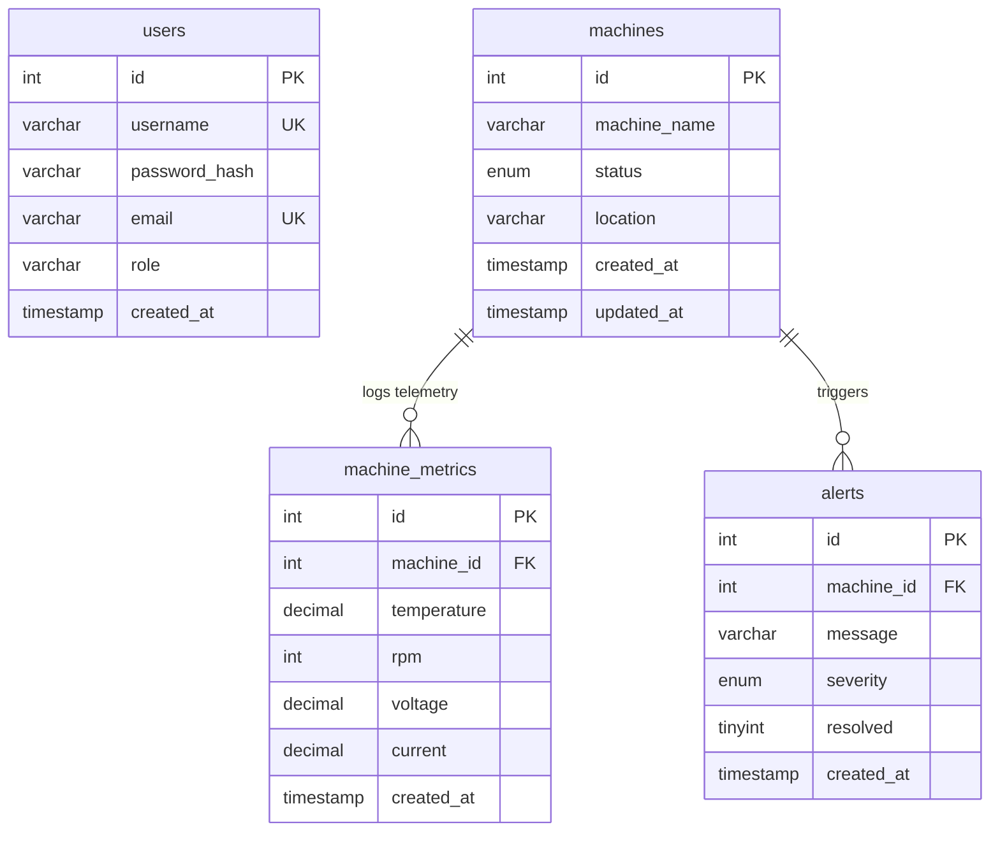

# MachineLink – Industrial IoT Cloud Platform

MachineLink is a complete, production-grade cloud-based Industrial IoT (IIoT) Monitoring Platform built to centralize and visualize real-time health data from factory machinery. 

Designed for scalability, ease of operations, and ease of deployment, this system utilizes a React SPA frontend styled as a premium SaaS dashboard, an MVC Express.js REST API backend, and a MySQL database orchestrating live telemetry updates. 

---

## Table of Contents
1. [Project Overview](#project-overview)
2. [Architecture Design](#architecture-design)
3. [Database Schema Design](#database-schema-design)
4. [API Endpoints Documentation](#api-endpoints-documentation)
5. [Telemetry & Alert Simulation Service](#telemetry--alert-simulation-service)
6. [Local Installation & Development](#local-installation--development)
7. [Docker Compose Deployment](#docker-compose-deployment)
8. [AWS Cloud Deployment Guide (EC2, RDS, CloudWatch)](#aws-cloud-deployment-guide-ec2-rds-cloudwatch)

---

## Project Overview

In a manufacturing floor, monitoring rotating machinery (CNC machines, robotic arms, heavy hydraulic presses) is critical to prevent unplanned downtime. MachineLink tracks critical performance KPIs:
- **Temperature** (detecting friction and motor anomalies)
- **RPM** (rotation speed load)
- **Voltage & Current** (power efficiency and electrical stability)
- **Status** (Active, Offline, Maintenance)

### Core Features
- **Collapsible Sidebar & Modern Dark Theme** tailored for industrial command centers.
- **Aggregated Analytics Page** displaying real-time Temperature and RPM trend graphs using Recharts.
- **Full Machine Registry (CRUD)** to search, filter, register, edit, and decommission factory machines.
- **Automated Alarm Dispatch System** triggering warnings on status changes and critical limit breaches.
- **Telemetry Simulation Service** updating machine sensor readouts in real-time every 5 seconds.

---

## Architecture Design

```text
       ┌────────────────────────────────────────────────────────┐
       │                 Frontend: React + Vite                 │
       │           (Tailwind CSS UI, Recharts, Axios)           │
       └───────────────────────────┬────────────────────────────┘
                                   │
                                   ▼ HTTP REST Requests (JWT)
       ┌────────────────────────────────────────────────────────┐
       │              Backend: Node.js + Express.js             │
       │                   (MVC Architecture)                   │
       └─────┬────────────────────────────────────────────┬─────┘
             │                                            │
             │ Starts Loop                                │ Reads / Writes
             ▼                                            ▼
┌──────────────────────────┐                    ┌──────────────────┐
│   Telemetry Simulation   │                    │  MySQL Database  │
│  (Real-time Sensor generator)                 │  (Storage Layer) │
└──────────────────────────┘                    └──────────────────┘
```

---

## Database Schema Design

The relational database resides in MySQL and contains 4 tables:



1. **`users`**: Manages operators and admins. Roles: `admin` (CRUD permissions) and `operator` (read-only).
2. **`machines`**: Core registry.
3. **`machine_metrics`**: Stores time-series telemetry logs.
4. **`alerts`**: Track unresolved and historical critical events.

---

## API Endpoints Documentation

All requests except authentication require a valid JSON Web Token (JWT) sent in the header as:
`Authorization: Bearer <JWT_TOKEN>`

### Authentication
* **`POST /api/auth/login`**
  * *Request Body*: `{ "username": "admin", "password": "admin123" }`
  * *Response*: Returns JWT token and user details.

### Machines Registry (CRUD)
* **`GET /api/machines`**
  * *Description*: Retrieve list of all machines along with their latest metrics.
* **`GET /api/machines/:id`**
  * *Description*: Fetch a single machine's metadata and its last 20 telemetry entries.
* **`POST /api/machines`** (*Admin Only*)
  * *Request Body*: `{ "machine_name": "Hydraulic Drill X", "location": "Sector 3", "status": "Active" }`
* **`PUT /api/machines/:id`** (*Admin Only*)
  * *Request Body*: `{ "machine_name": "Hydraulic Drill X Updated", "location": "Sector 3", "status": "Maintenance" }`
* **`DELETE /api/machines/:id`** (*Admin Only*)
  * *Description*: Deletes machine and its associated cascade records.

### Metrics & Analytics
* **`GET /api/metrics`**
  * *Query Param*: `?limit=50`
  * *Description*: Pulls general telemetry trend points.
* **`GET /api/metrics/:machineId`**
  * *Query Param*: `?limit=50`
  * *Description*: Returns chronological telemetry points for charts.

### Active Alerts
* **`GET /api/alerts`**
  * *Query Param*: `?active=true&limit=50`
  * *Description*: Lists active or resolved alerts.
* **`PUT /api/alerts/:id/resolve`** (*Admin Only*)
  * *Description*: Resolves an active alert manually.

### Dashboard Metrics
* **`GET /api/dashboard/stats`**
  * *Description*: Consolidated overview showing total/active/offline/maintenance counts, avg temp, avg RPM, and active alerts.

---

## Telemetry & Alert Simulation Service

Since real physical PLCs (Programmable Logic Controllers) are unavailable, a background telemetry simulation service runs inside the Node backend. Every 5 seconds:
1. It queries all registered machines in the database.
2. Generates new measurements based on status:
   - **Active**: Temp: 60-78°C (8% chance of spike > 85°C), RPM: 2800-3900 (8% chance of spike > 4500), Voltage: ~400V, Current: ~15A.
   - **Maintenance**: Temp: 40-50°C, RPM: 400-1000, Voltage: ~220V, Current: ~2.5A.
   - **Offline**: Temp: ambient (21-25°C), RPM: 0, Voltage: 0, Current: 0.
3. Automatically triggers alerts:
   - **Critical Temp Alert**: Temp > 85°C.
   - **Warning RPM Alert**: RPM > 4500.
   - **Warning Status Alert**: Status changes to 'Offline'.
4. Automatically resolves active alerts for a machine when its telemetry returns to normal ranges.

---

## Local Installation & Development

### Prerequisites
- Node.js (v18+)
- MySQL Server (v8.0+)

### Setup Database
Create a database named `machinelink` and run the script:
```bash
mysql -u root -p machinelink < schema.sql
```

### Backend Configuration
Create a `.env` file in the `backend/` directory:
```env
PORT=5000
NODE_ENV=development
DB_HOST=localhost
DB_USER=root
DB_PASSWORD=your_mysql_password
DB_NAME=machinelink
DB_PORT=3306
JWT_SECRET=machinelink_secret_jwt_key_2026
```
Run the backend:
```bash
cd backend
npm install
npm run dev
```

### Frontend Configuration
Run the frontend:
```bash
cd frontend
npm install
npm run dev
```
Open `http://localhost:5173` in your browser. Log in with `admin` / `admin123`.

---

## Docker Compose Deployment

The quickest way to spin up the entire cloud-ready workspace is using Docker Compose.

```bash
docker compose up --build
```
This builds and orchestrates:
1. `machinelink_db` (MySQL 8.0, maps port 3306, runs seeding SQL)
2. `machinelink_backend` (Express.js API, maps port 5000)
3. `machinelink_frontend` (React + Vite SPA, maps port 5173)

---

## AWS Cloud Deployment Guide (EC2, RDS, CloudWatch)

This guide prepares the project for an AWS Cloud deployment.

```text
                     AWS CLOUD INFRASTRUCTURE
 ┌──────────────────────────────────────────────────────────────┐
 │                      VPC (Virtual Private Cloud)              │
 │                                                              │
 │   Public Subnet                                              │
 │   ┌───────────────────────┐                                  │
 │   │    EC2 Instance       │ ◄──── Port 80 / 443 (HTTP/S)     │
 │   │   ┌───────────────┐   │                                  │
 │   │   │  React SPA    │   │                                  │
 │   │   ├───────────────┤   │                                  │
 │   │   │ Express API   │   │                                  │
 │   │   └───────┬───────┘   │                                  │
 │   └───────────┼───────────┘                                  │
 │               │                                              │
 │   Private Subnet                                             │
 │   ┌───────────┼───────────┐                                  │
 │   │           ▼           │                                  │
 │   │    RDS MySQL DB       │ ◄──── Port 3306 (Restricted SG)  │
 │   └───────────────────────┘                                  │
 └──────────────────────────────────────────────────────────────┘
```

### 1. AWS RDS MySQL Instance Setup
- **Service**: AWS RDS
- **Engine**: MySQL Community Edition (v8.0)
- **Templates**: Free Tier / Dev-Test
- **DB Instance Identifier**: `machinelink-db`
- **Credentials**: Set master username (`root`) and password (`rootpassword`).
- **VPC Security Group**: Create a security group `sg-machinelink-rds` that allows inbound traffic **only** on port `3306` originating from the security group of your EC2 instance (`sg-machinelink-ec2`). Do not make it publicly accessible.
- **Initial Database Name**: `machinelink`

### 2. AWS EC2 Setup & Configuration
- **Service**: AWS EC2 (t2.micro / t3.micro)
- **AMI**: Amazon Linux 2023 / Ubuntu 22.04 LTS
- **Security Group (`sg-machinelink-ec2`)**:
  - Inbound Rule: Allow `HTTP` on port `80` (Anywhere)
  - Inbound Rule: Allow `HTTPS` on port `443` (Anywhere)
  - Inbound Rule: Allow `SSH` on port `22` (Your IP)
- **Launch Instance** and connect via SSH:
```bash
ssh -i "your-key.pem" ubuntu@your-ec2-public-ip
```

### 3. Provisioning EC2 for Docker
Inside the EC2 instance, install Docker and Docker Compose:
```bash
# Update packages
sudo apt update && sudo apt upgrade -y

# Install Docker
sudo apt install docker.io -y
sudo systemctl start docker
sudo systemctl enable docker
sudo usermod -aG docker ubuntu

# Install Docker Compose
sudo curl -L "https://github.com/docker/compose/releases/latest/download/docker-compose-$(uname -s)-$(uname -m)" -o /usr/local/bin/docker-compose
sudo chmod +x /usr/local/bin/docker-compose
```
*Note: Log out and log back in to apply docker group membership.*

### 4. Deploying App on EC2 (Pointing to RDS)
Clone the repository onto the EC2 instance. Configure `.env` inside the clone to point the Backend to the RDS endpoint instead of the local DB:
```env
DB_HOST=machinelink-db.cxxxxxx.us-east-1.rds.amazonaws.com
DB_USER=root
DB_PASSWORD=rootpassword
DB_NAME=machinelink
DB_PORT=3306
JWT_SECRET=your_production_secret
NODE_ENV=production
```
Update `docker-compose.yml` to remove the local `mysql` container (since RDS is now used) or run the backend and frontend services directly.

### 5. AWS CloudWatch Integration
To monitor Express application console outputs and server CPU usage:
1. **IAM Role**: Create an IAM Role for EC2 with the policy `CloudWatchAgentServerPolicy` attached. Attach this IAM Role to your EC2 instance.
2. **Install CloudWatch Agent** on EC2:
```bash
sudo apt-get install amazon-cloudwatch-agent -y
```
3. **Configure Agent**: Run the wizard or write `/opt/aws/amazon-cloudwatch-agent/bin/config.json` to monitor server log files (e.g. Docker container outputs or application log files):
```json
{
  "agent": {
    "metrics_collection_interval": 60,
    "run_as_user": "cwagent"
  },
  "logs": {
    "logs_collected": {
      "files": {
        "collect_list": [
          {
            "file_path": "/var/log/syslog",
            "log_group_name": "MachineLink-EC2-Syslog",
            "log_stream_name": "{hostname}"
          }
        ]
      }
    }
  }
}
```
4. **Start Agent**:
```bash
sudo /opt/aws/amazon-cloudwatch-agent/bin/amazon-cloudwatch-agent-ctl -a fetch-config -m ec2 -c file:/opt/aws/amazon-cloudwatch-agent/bin/config.json -s
```
Your EC2 and application logs will now automatically sync to AWS CloudWatch Logs Console under the group `MachineLink-EC2-Syslog`.
